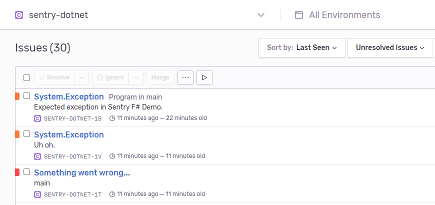
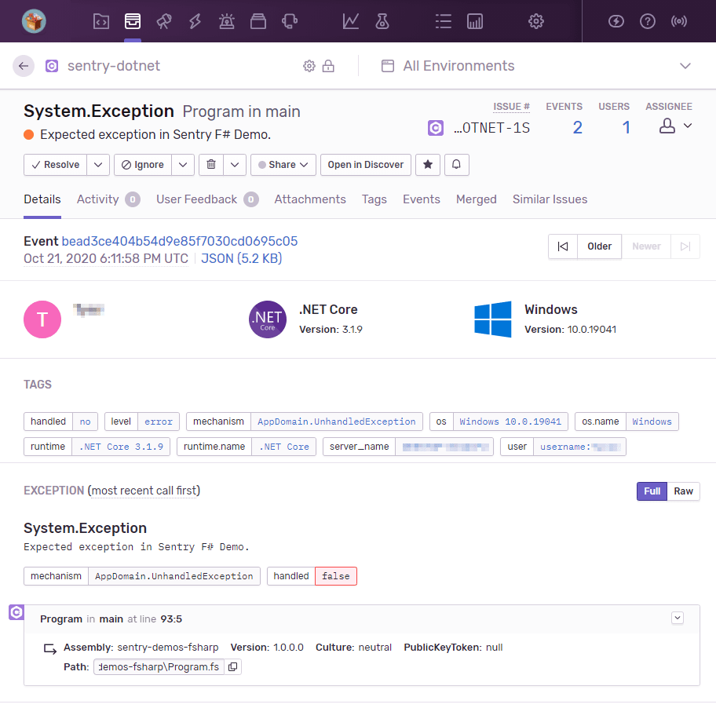
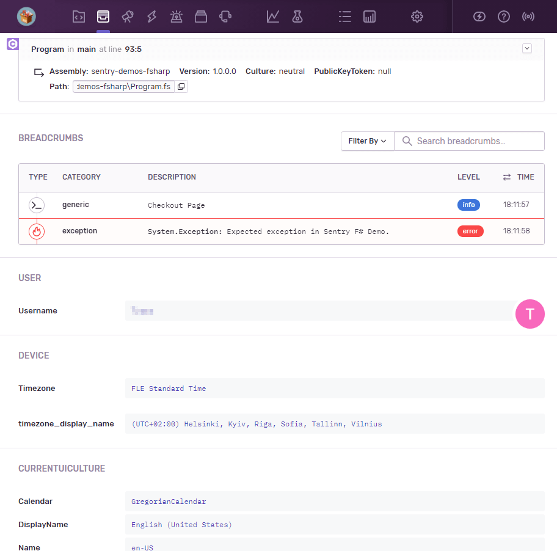

# Sentry F# Demo

This is a simple console application that demonstrates how you can add Sentry to your applications written in F#.
The current Sentry SDK supports any .NET application compatible with .NET Standard 2.0, which includes .NET Core 2.0+, .NET Framework 4.6.1+, Mono 5.4+, Xamarin.iOS 10.14+, Xamarin.Mac 3.8+, Xamarin.Android 8.0+, UWP 10.0.16299+, Unity 2018.1+.

- To install Sentry, you can use [NuGet](https://www.nuget.org/packages/Sentry):

```bash
dotnet add package Sentry
```

...or [Paket](https://fsprojects.github.io/Paket):

```bash
paket add Sentry
```

...or add it directly into your `.fsproj` file:

```xml
<PackageReference Include="Sentry" Version="3.0.0" />
```

- In order to integrate with Sentry, at a minimum, you need to initialize the SDK with your project's DSN:

```fsharp
open Sentry

use __ = SentrySdk.Init "my-dsn"
```

This will ensure that Sentry catches and reports all unhandled exceptions within your application.
You can then call various methods provided on `SentrySdk` to report errors manually, add breadcrumbs, contextual information, and many other things.

Please take a look at `Program.fs` for a more in-depth overview into Sentry's features and how you can leverage them via the .NET client.

## Running the demo

To run the demo, take the following steps:

0. Make sure that the latest [.NET SDK](https://dotnet.microsoft.com/download) is installed.
1. Go into `Program.fs` and change the `SentrySdk.Init` call to use your own DSN (change the value after `o.Dsn <- ...`).
2. Build and run the demo with `dotnet run -c Release` (or use your IDE).
3. You should see the following debug output in the console:

```ini
  Debug: Logging enabled with ConsoleDiagnosticLogger and min level: Debug
  Debug: Using 'GzipBufferedRequestBodyHandler' body compression strategy with level Optimal.
  Debug: Registering integration: 'AppDomainUnhandledExceptionIntegration'.
  Debug: Registering integration: 'AppDomainProcessExitIntegration'.
  Debug: New scope pushed.
  Debug: Configuring the scope.
   Info: Capturing event.
  Debug: Running processor on exception: Uh oh.
  Debug: Creating SentryStackTrace. isCurrentStackTrace: False.
  Debug: Running main event processor on: Event d1bc8afce6974acfb401bebdb8a82cd3
  Debug: Calling the BeforeSend callback
  Debug: Envelope queued up.
  Debug: New scope pushed.
   Info: Capturing event.
   Info: Overriding level set on event 'Info' with level set on scope 'Fatal'.
  Debug: Running main event processor on: Event f98d2b5b226c4dc3ae3374beeaed9448
  Debug: Creating SentryStackTrace. isCurrentStackTrace: True.
  Debug: Calling the BeforeSend callback
  Debug: Envelope queued up.
  Debug: Disposing scope.
  Debug: Tracking depth: 2.
  Debug: Envelope d1bc8afce6974acfb401bebdb8a82cd3 in-flight to Sentry. #2 in queue.
  Debug: Envelope d1bc8afce6974acfb401bebdb8a82cd3 successfully received by Sentry.
  Debug: Envelope f98d2b5b226c4dc3ae3374beeaed9448 in-flight to Sentry. #1 in queue.
  Debug: Envelope f98d2b5b226c4dc3ae3374beeaed9448 successfully received by Sentry.
  Debug: Signaling flush completed.
  Debug: Successfully flushed all events up to call to FlushAsync.
   Info: Capturing event.
  Debug: Running processor on exception: Expected exception in Sentry F# Demo.
  Debug: Creating SentryStackTrace. isCurrentStackTrace: False.
  Debug: Running main event processor on: Event bead3ce404b54d9e85f7030cd0695c05
  Debug: Calling the BeforeSend callback
  Debug: Envelope queued up.
   Info: Disposing the Hub.
  Debug: Envelope bead3ce404b54d9e85f7030cd0695c05 in-flight to Sentry. #1 in queue.
  Debug: Disposing SentryClient.
  Debug: Disposing BackgroundWorker.
  Debug: Envelope bead3ce404b54d9e85f7030cd0695c05 successfully received by Sentry.
  Debug: Shutdown scheduled. Stopping by: 00:00:10. #0 in queue.
   Info: Exiting the worker with an empty queue.
  Debug: Disposing scope.
  Debug: Disposing SentryScopeManager.
Unhandled exception. System.Exception: Expected exception in Sentry F# Demo.
   at Program.main(String[] _arg1) in E:\Projects\Softdev\!Work\sentry-demos-fsharp\Program.fs:line 93
   Info: Disposing the Hub.
  Debug: Disposing SentryClient.
  Debug: Disposing scope.
  Debug: Disposing SentryScopeManager.
```

4. On the [sentry.io](https://sentry.io) portal, you should see new events accordingly:



5. You can then inspect individual events in more detail:



